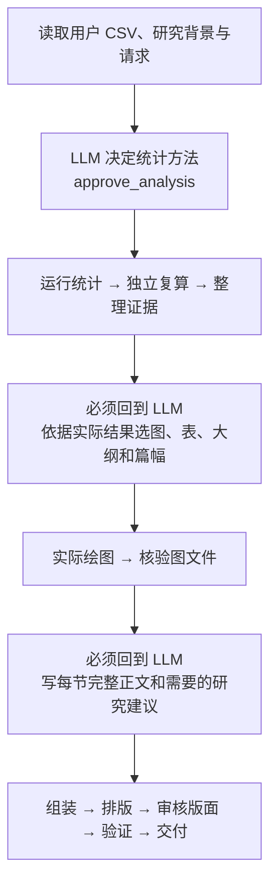

# 科研报告 Agent v3：结果出来后选图，模型写正文，Motif 执行交付

本 benchmark 检验一个具体问题：科研分析中的研究判断与文字仍由大模型完成，已经明确批准的计算、绘图、排版和复核步骤，能否从真实工具轨迹中学成 Motif，从而降低合格交付的总成本。

本目录是 benchmark 局部实现，复用仓库已有 DSH 启动入口、v1 预算代理及 v2 统计/绘图/PDF 组件，没有另写 Agent 循环，也没有修改上游 DSH 或 Motif 核心。它不是“给所有 Harness 装上就能自动优化任意任务”的通用插件产品。输入可以是用户 CSV；本轮实验的观测数据由独立随机种子合成，云模型、DSH、stdio MCP、数值计算、绘图和 PDF 文件均实际执行。

**当前状态：final 冻结版本 Linux Python 32/32、Node 24/24 测试通过，真实 MCP 列出 14 个工具；16 次正式留出运行均交付 PDF，独立科学/视觉审阅合格 11/16。** 普通组合格 5/8，Motif 组 6/8；实际库为 7 条边、2 段续接。技术交付通过不等于科研质量认可，独立 AI 审阅也不是学科专家认证。

## final 实测结果

实验 `research-report-agent-v3-final-20261010` 预登记四题、各两重复、两组共 16 次正式运行；全部保留，未按结果补跑或挑选最佳重复。8 个配对的输入、模型、工具 schema、运行代码与规范化系统上下文一致。独立审计从原始 HTTP/SSE、DSH 事件、内容摘要和最终交付记录复核到实际 CSV 统计、图和 PDF；正式 41 页均逐页审阅。

| 指标 | 普通 DSH | DSH + Motif |
|---|---:|---:|
| 正式运行 / 技术交付 | 8 / 8 | 8 / 8 |
| 独立科学/视觉门槛合格 | 5/8（62.5%） | 6/8（75%） |
| 真实 LLM 请求 | 148 | 81 |
| DSH 工具调用尝试 | 140 | 129 |
| 成功工具执行 | 112 | 112 |
| 工具失败（业务拒绝 / schema 错误） | 28（24 / 4） | 17（16 / 1） |
| 已核验 Motif 绕过 | 0 | 56 |
| 运行 API 峰值估费 / 元 | 0.76001672 | 0.56069888 |
| 运行 API 非峰估费 / 元 | 0.38000836 | 0.28034944 |
| 全部运行峰值费用 / 合格报告数 | 0.152003344 | 0.093449813 |

本批运行 API 估费下降 **26.23%**，请求下降 **45.27%**。请求差 67 次包括 56 次已核验确定性续接和 11 次较少的语义提交失败；不能全部归因于插件。两组自由正文长度、选图方案、缓存命中及最终回复也会影响费用。这里没有冻结相同正文，四题两重复也不足以证明普遍质量提升。

5 份正式报告未过科学门槛：普通组自动报告把标准误当作区间宽度；普通组技术报告断言当前高温端稀疏而数据不支持；Motif 组指定大纲报告把 4/64 写成约六分之一；普通组一页报告从合成数据越界断言工程用途；Motif 组技术报告混淆解释变量与响应变量测量误差对斜率的影响。数字绑定、来源和排版都通过仍可能出现这些科学意义错误。合格报告也保留 minor 问题，不能直接视为可发表稿件。16 份均只调用一次 `layout_report`，共测试 64 个内部排版候选，无排版失败或同稿循环；另有 3 次一页容量前置拒绝，模型随后压缩正文，其成本均已计入。

新两条训练加一条独立认证的峰值费用为 **0.22189280 元**。加上本批 8 次 Motif 运行，总计 **0.78259168 元**，仍高于 8 次普通运行的 0.76001672 元，本批**尚未回本**。若未来任务保持本批平均运行差额且不需要重新训练，仅摊销这项训练/认证费用，情景计算约第 **9 份报告**达到平衡；这不是已实测部署结果，也没有包含开发成本。

旧 3 次校准的峰值费用 0.30394048 元另计；本轮校准、训练/认证、正式运行合计 **333 次请求、1.84654888 元峰值 / 0.92327444 元非峰估费**。与历史实验共用账本累计 **1164 次请求、5.85411408 元峰值 / 2.92705704 元非峰估费**，旧账本字节前缀保持一致，无未归档的新请求或未知 usage。这些仅是 DeepSeek token 估费，排除服务器、实现开发和外部 Codex 独立 AI 审阅费用，既不是总拥有成本，也不是平台账单。

可追溯结果位于 [完整独立审计 `audit-final.json`](../../.local/research-report-agent-v3-final-20261010/review/audit-final.json) 和 [逐报告科学/视觉审阅 `scientific-reviews-final.json`](../../.local/research-report-agent-v3-final-20261010/review/scientific-reviews-final.json)。前者含开发、训练及正式 22 次运行的原始证据核验、费用、配对条件、库见证和最终质量；后者包含新训练 3 份与正式 16 份原始 PDF 的审阅，旧校准以独立命名空间合并到总审计。`.local` 原始证据不提交到 Git；复现或转交结果时须单独保留整个实验目录。

## 三次语义决定是什么

1. 读取 CSV 和研究说明后，LLM 提交统计方案 `approve_analysis`，并引用用户材料中支持该设计的原文。此时不能预先选图、写正文。
2. 完成统计与独立复算后，LLM 看到实际效应、区间和诊断，再通过 `approve_presentation` 选择图、表、大纲和篇幅，并说明选择理由。
3. 实际图文件生成并检查后，LLM 通过 `submit_report_text` 写出每一节的完整正文。它收到真实图的类型、标题、图注及统计数值；这不等于模型看过图像像素。图像和页面视觉质量还需另外审阅。

这些 `approve` 是模型提交且工具校验的方案，不要求用户每个步骤手工点击批准。每次方案必须明确提供 `allow_deterministic_continuation` 布尔值：`true` 只允许当前已批准段的确定性续接，`false` 不授权插件续接；工具不会偷偷补 `true`。



图表示人工设计的工具能力与语义边界。**中间哪些边实际能由 Motif 接管，要看正常 DSH 轨迹的训练和独立认证结果。** 没被见证的边仍由 LLM 发起工具调用，不能按这张图手工补进 Motif 库。三个决策点也不意味着全程只有三次 API 请求：输入检查、工具选择、错误修订、最终回答等都可能产生额外请求。

## 普通 DSH 与 Motif 组的共同条件

两组使用相同数据字节、用户请求、模型 `deepseek-flash`、完整工具集合及其顺序、预算代理、输出上限和质量门槛；`thinking` 禁用，DSH 的 `llm-retry`、`compaction-basic`、`command-compact` 与 `tool-result-pruner` 显式关闭。工具错误后模型自行修订仍会产生真实请求并计费。

普通组自由调用上述 14 个工具。Motif 组额外通过公开的 `ctx.on('llm/stream', ...)` 和 `tools/result` 事件接入。DSH 准备向 LLM 发下一次请求时，插件检查上一工具结果是否存在唯一、已见证且被授权的参数传递；通过才返回一条结构化工具调用，DSH 按原有工具执行机制调用 MCP。

这里的“请求 LLM”是把对话和工具 schema 发给云模型，请它生成下一步；“MCP 调用”是 DSH 按具体工具名和参数，请本地 MCP 服务真正计算或生成文件。插件省的是某一次前者，后者仍执行。例如上一结果已有 `text_id`，且 `text_id → compose_report(text_id)` 在训练和认证中真实出现并获本次授权，插件就能生成这条工具调用，无须请模型再抄一次 ID。

统计时必须区分命令尝试和成功执行：日志中的 `tool_calls` 计数为 **DSH 工具调用尝试**，包含成功、业务拒绝及 schema 错误，不能全部称为成功 MCP 调用。final 主实验共有 269 次尝试，普通组 140、Motif 组 129；两组各成功执行 112 次 MCP 工具，合计 224 次。其余 45 次为 40 次业务拒绝和 5 次 schema 错误，全部保留节点、失败记录和费用。原始参数中有 1 次坏 JSON，该事件同时有服务端 Pydantic 拒绝记录，不能据此宣称请求没有抵达 MCP；它属于上述失败的诊断属性，不是另加一次失败。

图中蓝色和绿色表示同一批工具命令的来源。56 条绿色命令由 Motif 绕过对应 LLM 请求后生成，已经包含在 269 次尝试及相应成功执行中，不能将 56 再加到 269 上。真实云请求总数另从 HTTP 记录统计，不能把工具节点数直接当作 LLM 请求数。

主实验让两组各自自由选择展示方案并写正文；不冻结任何一组的图型、篇幅或文字，也不额外给 baseline 增加上下文负担。两组最终内容可能不同，因此成本差异必须结合实际方案、失败修订和报告质量解释，不能自动归因为只改变了一个固定流程中的调度开销。

## 用户 CSV 入口

从仓库根目录运行；Python、Node、DSH 和本仓库依赖须已安装。Linux 本轮使用 `.venv-sss/bin/python`，激活同一环境后可使用下文的 `python`。

```sh
python benchmarks/research_report_agent_v3/runner.py \
  --data /path/to/measurements.csv \
  --request-file /path/to/request.txt \
  --study-json /path/to/study.json \
  --outline-file /path/to/outline.txt \
  --out .local/research-report-agent-v3-user/runs/my-study \
  --experiment-id research-report-agent-v3-user \
  --experiment-role ad_hoc \
  --budget-ledger .local/research-report-agent/global-ledger.jsonl
```

默认只预览，不调用模型。`--study-json` 和 `--outline-file` 可省略；文件必须为 UTF-8。研究说明宜包含字段含义、单位、实验单元、独立/配对关系、研究设计和数据来源。缺少这些背景时，程序不能根据文件名猜测因果、随机化或实验设计；可能返回需要补充信息。用户大纲的标题和顺序保留，需能覆盖方法、结果、诊断和局限等科学内容。

真实执行在父进程环境配置 `DEEPSEEK_API_KEY`，再添加 `--call-model`。当前会话已经授权总计人民币 100 元的实验预算；v1、v2、v3、训练、认证、试跑、失败和修订共同使用上面的全局账本，不能给 v3 另开账本假装预算重新开始。密钥不放入命令参数或输入文件；子 DSH 仅持本地预算代理令牌，代理向官方端点发真实请求。

每次有结果的运行必须用新目录，不能覆盖旧证据。单次 runner 的纯预览可以在同目录继续真实执行。`--out` 必须位于本仓库被忽略的 `.local/`；输入复制到该运行的 `sources/cases/<id>/`，产物只写该运行的 `workspace/`。用户原始文件保持不变。v3 明确拒绝 `benchmark_frozen_decisions`，以免把事先准备的展示/正文当成主实验的实时决定。

## 精确复现本轮 19 次矩阵

在仓库根目录、已有依赖的 Linux 环境中执行。输出目录必须全新。下面先准备数据和预声明，不发生 API 调用：

```sh
python benchmarks/research_report_agent_v3/prepare_experiment.py \
  --output .local/research-report-agent-v3-final-20261010 \
  --experiment-id research-report-agent-v3-final-20261010 \
  --seed-offset 1000000

python benchmarks/research_report_agent_v3/run_matrix.py \
  --matrix .local/research-report-agent-v3-final-20261010/training-matrix.json \
  --data-root .local/research-report-agent-v3-final-20261010/data \
  --experiment .local/research-report-agent-v3-final-20261010 \
  --experiment-id research-report-agent-v3-final-20261010 \
  --budget-ledger .local/research-report-agent/global-ledger.jsonl
```

确认使用本轮已授权的环境密钥后，实际运行三条普通 DSH 轨迹：

```sh
python benchmarks/research_report_agent_v3/run_matrix.py \
  --matrix .local/research-report-agent-v3-final-20261010/training-matrix.json \
  --data-root .local/research-report-agent-v3-final-20261010/data \
  --experiment .local/research-report-agent-v3-final-20261010 \
  --experiment-id research-report-agent-v3-final-20261010 \
  --budget-ledger .local/research-report-agent/global-ledger.jsonl \
  --call-model
```

三条均达到交付门槛后，从实际轨迹编译：

```sh
python benchmarks/research_report_agent_v3/compile_motifs.py \
  --train .local/research-report-agent-v3-final-20261010/runs/v3_train_materials_baseline \
          .local/research-report-agent-v3-final-20261010/runs/v3_train_ml_baseline \
  --certify .local/research-report-agent-v3-final-20261010/runs/v3_cert_environment_baseline \
  --output .local/research-report-agent-v3-final-20261010/library.json
```

运行主实验 16 条；`--workers` 固定为 1，两次重复交换每题两组的先后顺序：

```sh
python benchmarks/research_report_agent_v3/run_matrix.py \
  --matrix .local/research-report-agent-v3-final-20261010/evaluation-matrix.json \
  --data-root .local/research-report-agent-v3-final-20261010/data \
  --experiment .local/research-report-agent-v3-final-20261010 \
  --experiment-id research-report-agent-v3-final-20261010 \
  --budget-ledger .local/research-report-agent/global-ledger.jsonl \
  --call-model
```

不加最后的 `--call-model` 就只显示矩阵与完整命令，既不要求密钥也不执行任务。矩阵脚本运行前拒绝覆盖任何既有 run 或矩阵结果；运行中逐次保存结果，失败保留在分母里。发生实现修正时应另记开发运行并重新声明正式代码快照，不能覆盖原失败结果。

| 案例 | 分组 | 请求与数据种子 |
|---|---|---|
| `v3_train_materials` | 训练 | 材料强度两组比较，组织与篇幅自定；910017 |
| `v3_train_ml` | 训练 | 相同数据划分的算法配对比较；920029 |
| `v3_cert_environment` | 独立认证 | 温度与溶解氧关联及诊断；930031 |
| `v3_eval_auto` | 留出评测 | 生物量分析，自定大纲和篇幅；940007 |
| `v3_eval_outline` | 留出评测 | 学习者前后测，保留用户大纲、最多三页；950001 |
| `v3_eval_brief` | 留出评测 | 设备负载与能耗，恰好一页、至少一图；960003 |
| `v3_eval_technical` | 留出评测 | 温度与溶解氧，按本次结果比较后续研究选择；970011 |

生成器只复用旧版数值分布方法，表中是基础种子，正式 final 实验统一加 `1000000`，实际种子为 1910017、1920029、1930031、1940007、1950001、1960003、1970011。数据全新创建；oracle 留在模型不可见目录。`--seed-offset` 用于新实验并写入 manifest，不修改已有数据。四项留出任务各两组、各两次，主统计分母固定为 16；重复只反映运行波动，独立任务数仍为 4。云端缓存自然发生，记录实际 hit/miss，不用清缓存制造对照差异。

## 学习的范围与执行守卫

人工设计的是工具能力、三处语义边界、输入输出契约及允许的后继。编译器学习的是**实际相邻成功调用中，哪个输出字段成为下一调用唯一参数**。它还要求本次 receipt 明确授权后继、两项独立训练均有见证、第三项独立认证也有见证，且实际模型工具 schema 相同。换案例名但复用同一 CSV 不算独立任务，评测轨迹不得混入训练。

`observed_authorized_edge_coverage` 保留候选的覆盖和缺证据状态；`learned_chains` 仅连接已经入库的边。没有自动发现任意业务类型，也没有用固定向量伪装语义匹配。认证意味着另一成功轨迹提供独立见证，不是形式化正确性证明。

**final 三条真实普通轨迹编译得到 7 条边、2 段续接：绘图与图检查的 2 条边，以及正文批准后的组装到交付 5 条边。** 统计段的 3 条候选只有一个训练任务提供合格见证，未满足两训练加独立认证的条件，因此没有录入。正式 Motif 组的统计工具仍由 LLM 发起，不能把设计图中的三段候选都画成已生效 Motif；每次实际接管仍须看该 run 的审计记录。这个观察说明缺少明确授权或重复见证会限制优化覆盖，不能手工补边来扩大收益。

插件每一步都核对用户请求、CSV/元数据/任务文件哈希、工作区、真实 record 文件摘要、完整工具 schema、唯一参数绑定、权限以及已执行状态。内容或条件变化即回到正常 LLM；自动工具失败或结果不可核验会使本 run 停止继续自动接管。模型生成坏 JSON 时，插件需看到新的、输入与 receipt 严格绑定的语义批准才能恢复，不能靠旧批准继续。

## 正文、报告质量与记录

LLM 写完整段落，但数字使用 `{{estimate}}`、`{{ci_low}}`、`{{n}}` 等已验证字段。工具只把这些标记替换为确定值、插入模型自己写的研究选项、放置已批准图表并排版；不生成标准正文代替模型，不暗删文字，也不把因页数不足而补写的内容当作模型原创。图注、数值表、页眉和来源标识是确定性标签，不能宣称 PDF 每个字都由 LLM 写成。完整规则见 [TOOLS.md](TOOLS.md)。

若一页放不下，先返回真实容量检查，再让模型修订同一个 `packet_id` 的正文；不无故重算有效统计或重画图片。相同正文草稿与排版引擎版本会复用成功或失败的排版结果，同时检查图/PDF 哈希。布局修复只调整排版参数，不改写科学结论。

模型回答“完成”不足以把 run 标为 `done`：最后一次 `verify_report` 和 `deliver_report` 均需通过，后者返回 `delivered=true`、`quality_passed=true`。**这些检查证明结构、数值绑定、文件和版面满足既定门槛，不能证明自由论述的科研判断正确。** 当前结果显式保存 `scientific_prose_verified=false`；需独立阅读统计解释、图文对应、诊断、因果边界、建议合理性及逐页视觉效果。

| 证据 | 用途 |
|---|---|
| `preregistration.json`、两个 `*-matrix.json` | 事先声明分组、16 次主分母、顺序与判定边界 |
| `manifest.json`、`intake.json` | 输入、模型、工具及代码配置；包含复用 v1/v2、src、config、scripts 的哈希 |
| `agent-events.jsonl` | DSH 实际工具名、参数、结果和 call ID |
| `model-requests/`、`cost-ledger.jsonl` | 每次真实 HTTP 请求、SSE 响应、usage、失败和估费 |
| `motif-audit.jsonl` | 接管尝试、已验证跳过、回退及其 call ID |
| `metrics.json` | 请求数、cache token、估费、耗时、失败、交付和三处语义输入摘要 |
| `workspace/records/` | 完整批准实参、原文、token 替换、来源和逐段 lineage |
| `workspace/artifacts/` | 实际图、PDF、布局尝试与检查证据 |

应从原始模型响应核对语义 call ID，再沿 record 追到报告正文，不能只相信 metrics 中的 `source` 标签。预算代理按官方价格表估算并保留未知 usage 的保守金额，金额仍需平台账单核对；不能把 usage 缺失当成零成本，也不能只报成功任务的费用。

## 离线验证与实现位置

```sh
python -m unittest discover -s benchmarks/research_report_agent_v3/tests -v
node --test benchmarks/research_report_agent_v3/test_motif_plugin.mjs
```

在线代码以 [motif_plugin.ts](motif_plugin.ts) 为源文件，使用 JavaScript 兼容子集，部署的 `.mjs` 与其字节一致，测试会核对。Python 离线编译、预算代理及 MCP 依赖仍存在，不宣称已经打包成零 Python 依赖的生产插件。具体工具实现见 [workflow_tools.py](workflow_tools.py)，注册见 [server.py](server.py)，手工工具契约见 [tool_contracts.json](tool_contracts.json)。

## 从校准运行到 final 冻结版本

旧实验 `research-report-agent-v3-20261010` 的三项普通 DSH 运行作为校准记录完整保留，其失败、重试及 API 费用属于开发成本，不从累计预算中抹去。校准暴露了正文输入结构不够明确，以及合法图号/段内连续序号被误判为未绑定科学数字的问题。

final 版本把 `submit_report_text.report_text` 升级为公开给模型的强 `ReportText` schema：要求 `sections` 和严格布尔权限，每节明确要求 `heading, paragraphs, figure_indices`，拒绝额外字段；可选字段不人为补入原始批准参数。正文仍由模型写，结构校验不生成文字。仅已存在的真实图号与合法连续列表编号作为格式引用豁免，并在 `formatting_references` 留痕；效应、样本量、区间和阈值等科学数字仍必须绑定真实证据。来源 hash/路径保存在旁证，不在正文中当作数值例外。

该变更改变了实际模型工具 schema，因此 final 使用新的数据、实验 ID、代码快照，并重新收集两条训练和一条独立认证；旧校准轨迹或旧 library 不能混入。主实验不提前固定图表或正文，使用同一 final schema 比较两组。
