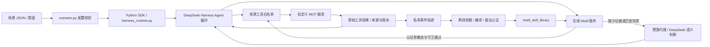

# DeepSeek Harless：场景、Motif 和 Harness 的接口

## 官方 Web 与统一任务接口（0.1.5-rc.3）

`npm run web` → `scripts/harness-web.py` → 官方 `dsh --profile web --patch <私有 host overlay>`。执行、会话、队列、模型消息和工具调度归官方 Harness；SDK 的 `run-scenario.py` 与 `harness_runtime.py` 保留。场景配置定义能力，不再固定一次用户任务。默认动态策略为 `src/adapters/dsh_web_tasks.ts`，请求规范化在 `web_task_request.ts`，双层预算路由在 `web_task_budget.py`，DeepSeek Harless 界面为同源 `/tasks`。旧 `/sss` 是兼容别名，历史代码/环境变量标识保持不变。

后续涉及模型的联调与场景验收统一走真实 API：`npm run web:real` 等价于 `npm run web -- --real-model`；`npm run scenario:real` 等价于 `npm run scenario -- --call-model`。前者仍通过工作台预览确认任务，后者直接执行预算预览后的一次场景；均保留原有预算代理。用户已授权此测试用途，默认沿用现有 0.25 美元额度，扩大上限或外部副作用另行确认。纯单元、无模型 smoke 和故障注入仅作开发诊断；真实调用失败不得用模拟成绩替代。SDK 真实最小场景已完成 3 次 HTTP 200 与 4 次 MCP，见[真实调用记录](experiments/deepseek-real-api-smoke-20261009-v1.md)；现有 3080 模拟服务未重启，真实 Web 后端最小闭环已通过，浏览器交互仍待验收，见[恢复记录](experiments/web-real-recovery-20261009-v1.md)。

### 前端提交与任务生命周期

官方真实聊天的 `session/prompt` 首次提交登记 `entrypoint=native_chat` 的待确认任务，返回 accepted，不直接调用模型。公开 Web `tapIndex` 注入题面/预算确认框，显式确认通过下述 submit API 才派发原消息；相同请求 ID 幂等，取消零模型调用。工作台 `?task_id=...` 和任务卡可以恢复同一待确认预览。`entrypoint` 是服务器响应字段，不接受客户端自行指定；新的要求仍需新的任务/Session。实际接口验收见[记录](experiments/native-chat-confirm-20261009-v1.md)，真实浏览器点击待确认。

先打开本次私有 `access-url.txt` 的官方认证地址，用根路径 token 交换 HttpOnly/SameSite cookie。工作台及 `/api/harless/tasks` 复用官方连接认证；不是可匿名访问的 API，也未开放其他前端域名的 CORS。不要在 URL/header 中另传认证 token。旧 `/api/sss/tasks` 保留同语义兼容路由，新调用统一使用产品路由。

| 操作 | 请求与结果 |
| --- | --- |
| 预览 | `POST /api/harless/tasks`，`{"action":"preview","request":<业务请求>}`；返回任务、输入摘要、来源、预算、模式和 `confirmation_digest`，不调用模型 |
| 提交 | 同一路径，`{"action":"submit","task_id":"…","confirmation_digest":"预览值"}`；核验后启用预算并交给官方 `Controller.prompt` |
| 取消 | 同一路径，`{"action":"cancel","task_id":"…"}`；取消官方 Agent 并关闭该任务后续模型请求 |
| 上传文件 | 同一路径，`{"action":"upload","task_id":"草稿ID","name":"paper.tex","data":"规范base64"}`；走官方 `fileUploads`，返回更新后的预览；提交必须使用最新摘要 |
| 查询 | `GET /api/harless/tasks?task_id=…` 返回详情；省略 ID 返回任务列表及汇总统计 |

免费工作台点击“开始免费联调”会自动执行 `preview → upload（如有文件）→ submit`，不展示额度表单或要求第二次确认；服务端仍保留规范化、任务登记、最新摘要绑定和统计。真实模式必须展示预算预览并由用户明确确认，不能利用免费流程绕过。

上传只对待确认任务开放，单文件上限 256 KiB。任务状态为 `awaiting_confirmation/running/completed/failed/cancelled/budget_exhausted`。同进程支持连续多任务，同一时刻一个活动任务，一任务一 Session；后续问题创建新任务/Session，不复用旧任务授权。`request_id` 重复且内容相同返回已有任务；内容或模式/预算改变而复用该 ID 则拒绝。重复提交不重新执行已接纳任务。goal 续轮、队列内容编辑、fork/steer 均不能绕过任务绑定；更改输入须预览新任务。

业务请求可以直接是文字字符串，也可以是下面的对象：

```json
{
  "instruction": "检查这些批注，整理有来源依据的结论",
  "capability_profile": "example",
  "inputs": [{"resource_id": "paper-notes"}],
  "mode": "shadow",
  "budget_usd": 0.1,
  "request_id": "client-request-001"
}
```

对象必须在 `instruction`、`content`、`messages` 中三选一。`instruction` 是字符串；`content` 是字符串或有序官方内容块；`messages` 为 `[{"role":"user","content":…}]`，仅接受 user，以可见边界保序合成一次输入，不能伪造 system/assistant/tool 历史。正文原字节和顺序保留，拒绝 NUL、空任务及超限内容。规范化上限当前为 768 KiB、32 个内容块；文件另受上传上限。`task_id/session_id`、工具、provider、manifest 和输出/请求上限由服务器决定，不接受客户端覆盖。

Harness 原生 `SessionPromptRequest.content` 的实际格式为：

```json
[
  {"type": "text", "text": "检查附件"},
  {"type": "image", "mediaType": "image/png", "data": "规范base64", "name": "figure.png"},
  {"type": "file", "receiptId": "同Session此前上传返回的receipt"}
]
```

图片支持的声明类型为 PNG/JPEG/WebP/GIF。官方 Controller 再校验图片字节、模型输入能力和文件 receipt 所属会话；持久 `attachmentId` 不能替代上传 receipt。当前诊断确认不支持图片的模型会令任务明确失败、请求数为零；接收协议不代表已实现图片理解。`input_summary` 仅含文字/图片字节数与摘要、receipt 摘要和引用标识，不重复图片 base64；完整输入快照只留私有任务目录。

### 场景、资料与三种模式

每次启动由 `--scenario` 注册一个受信任能力配置，支持场景名或配置 JSON 路径；前端只能选择这一个 `capability_profile`。工具由该场景 MCP/preset 提供，默认编码工具仍待明确兼容。`prepare_scenario()` 的 `mcp_rows/environment_references` 同时服务 Web preset 与原 SDK patch。

`--resources .local/inputs/resources.json` 登记文本资料，格式是 `ID -> {"text_file":"相对登记文件的UTF-8文本路径"}`。单来源上限 256 KiB，启动时读取并计算原始字节 SHA-256；`inputs.resource_id` 只引用该注册表，不能指定路径或 URL。后端检查可选期望版本，追加带 ID/版本的文本，并记录 `sources[{resource_id,version,sha256}]`。本轮是不可变来源快照，原文件改动不会自动刷新；未登记资料拒绝，不能假装已读取。真实应用的对象解析器是后续扩展。

- `baseline`：正常 Harness，不接管结构步骤。
- `shadow`：有适用认证库时记录候选，继续模型路径。
- `execute`：有适用认证库且守卫通过时生成标准工具 stream，由 Harness 真正执行；结果复核后计 verified skip。

三种模式逐任务固定并写入统计。无库、无 embedding、认证无效或输入不适配时记录 `fallback_reason`，继续正常 Harness。example 尚无库；portfolio 精确冻结题面可使用首发历史库。新增附件、来源或题面不能自动继承旧认证任务绑定。真实 schema 按 `scopeOf(agent.ctx)` 和官方代码点工具顺序核验，参数来源和版本守卫仍保留；不能用“支持动态任务”为由取消认证。

### 预算、模型与记录

每任务默认 0.25 美元/24 次，全启动默认 0.25 美元/256 次，每请求最多 1000 输出 token。前端预算只能下调服务器任务上限；`--budget-usd/--request-limit` 定任务上限，`--run-budget-usd/--run-request-limit` 定全启动上限。`TaskBudgetRegistry` 先不可变注册，确认后激活；预算代理根据 `x-deepseek-harness-session-id` 路由，同一次请求原子占用两层额度，完整成功用量两层结算，新任务不重置全局限制。

私有控制服务仅监听 loopback，`/tasks/register/activate/cancel/stats` 均要求 `X-SSS-Control-Token`。该 token 由启动器生成，不提供给浏览器。固定 provider/model、`reasoning_effort="off"`、输出 cap，关闭标题模型、辅助请求和压缩；UI 模型菜单不能绕过预算连接。

默认模拟模式无实际支出；`npm run web:real` 显式开放 DeepSeek 连接，仍须工作台预览确认。服务器私有根 `.env` 通过统一 `scripts/project.mjs` 的 `loadEnvFile` 加载（Node 20.12+，已有环境值优先），字段见 `.env.example`。真实模式拒绝原生聊天直接执行付费任务。SDK 基本连通已通过真实 API 验证，真实 Web 尚未验收；其他收费 MCP 和人工费用也不在这份模型代理额度内。

任务响应含 `task_id/session_id/request_id`、模式、预算、状态/失败、时间、来源、摘要、答案与 `stats`。统计字段包括 `upstream_requests/model_requests`、`llm_decisions`、`tool_calls/tool_errors`、`motif_attempts/shadow_candidates/verified_skips`、`prompt_tokens/prompt_cache_hit_tokens/prompt_cache_miss_tokens/completion_tokens/total_tokens`、`estimated_cost_usd/observed_peak_cost_usd`、`denials/pending_requests/unknown_usage_requests/usage_complete`、`elapsed_seconds` 与全局预算/请求计数。未取得完整用量时保留保守预留，token 缺失不能当作零成本；代理估值不等于账单。模拟 `actual_paid_usd=0`，真实支出未核对时为 null。

启动输出独占 `.local/web/runs/<RUN_ID>/`，包含环境、commit/dirty 摘要、私有 policy/overlay/preset 和全局 `ledger.jsonl`。动态任务各自存于 `tasks/<TASK_ID>/`，包含 `task.json`、`effective-config.json`、`session-header.json`、`task-state.json`、`events.jsonl`、`answer.json/answer.md`、`ledger.jsonl`、`motif-audit.jsonl`，接管时另有 `bound-motif-task.json`。失败和取消记录保留，不能清空旧 ledger 重置额度；跨启动恢复尚未实现。

### 旧固定入口与验收范围

`npm run web -- --frozen` 保留原 `dsh_web_policy.ts`：一个启动周期一个固定题面/session，题面仅两端空白规范化，内部字符必须一致。服务器最终验收通过 146 项 Python、44 项 Node、`web:check` 的 11 组冻结协议、`web:tasks:check` 的 13 组动态 HTTP/MCP，以及 18 题/83 来源 smoke；Motif 样例闭环已通过，新增实际付费为零。详细条件与限制见[动态任务验收](experiments/dynamic-web-tasks-20261009-v1.md)和[Web 交接](handoffs/harness-web.md)。原生会话 unary `/api/session/<method>` 使用官方 client-request envelope，队列/事件流使用 `/api/remote.mux`；DeepSeek Harless 不替换 Agent 循环。

HTTP 检查不能代替实际浏览器和科研质量验收。安全边界仍是单操作人服务器联调：没有多账号、跨启动恢复或论文流程，认证浏览器的官方文件能力也不是多人文件沙箱。上游包只读，升级必须复核 Controller、Gateway、附件、事件与 preset 接缝。详见 [Web 交接](handoffs/harness-web.md)。

## 运行链路与边界



Python controller 与 JavaScript online runtime 是两条执行路径：在线插件使用 JS 子集，并未通过 RPC 调用 Python controller。不要把它们描述为完整同构实现。DSH 实际执行 MCP 工具；插件只在认证的只读步骤上替代一次模型决策。

## 已确定的技术路线与当前交付形态

后续采用 **Python 离线学习/编译，TypeScript 在线执行**。新增 Harness 在线逻辑使用 TypeScript；现有 JS 插件逐步迁移，Python controller 保留为参考和离线验证。生产在线 Runtime 以 TypeScript 为权威，不另建 Python 在线决策进程。双方通过版本化、带摘要及证据的 Motif IR/library 对接；类型定义之外仍需运行时校验和协议一致性测试。

当前安装清单固定 `@deepseek-ai/dsh` 为 `0.1.5-rc.3`，安装后由 `harness_runtime.py` 启动 `node_modules/@deepseek-ai/dsh/lib/bin.js`。因此运行时包含真正的本地 Harness，Git 仓库不内置其源码副本。`dsh_online_motif.mjs` 是原生插件，通过生成的 patch 和本地文件 URI 挂载；baseline 不加载该插件，shadow/execute 显式加载。

DeepSeek Harless 当前是“插件实现 + 编译器 + 科研实验环境”，还不是独立分发的 Harness 插件包。产品化需要严格类型、共享 Schema/兼容规则、构建/打包和安装入口。实验入口及预算代理使用 Python；在线 `runPureCode` 还会启动 `pure_code.py`。解除已有 library 执行对 Python 的依赖时，必须保留预算约束和纯代码隔离/校验，不能简单删掉这两项。外部 MCP 和 embedding 服务的部署依赖仍由具体服务决定。

## 1. 自定义 MCP 场景接口

每个场景放在 `scenarios/<name>/`，包含 `scenario.json`、题面、必要的服务/契约和独立测试。复制 example 即可。配置版本是 `schema_version: 1`；服务器顺序、工具名字/顺序和提示尽量保持稳定。

```json
{
  "schema_version": 1,
  "name": "my_scene",
  "prompt": "prompt.md",
  "servers": [{
    "server_name": "papers",
    "transport": "stdio",
    "command": "${PYTHON}",
    "args": ["${PROJECT_ROOT}/scenarios/my_scene/server.py"],
    "cwd": "${PROJECT_ROOT}",
    "env": {"PAPER_API_KEY": {"from_env": "PAPER_API_KEY"}}
  }],
  "allowed_tools": ["mcp__papers__find", "mcp__papers__read"]
}
```

支持 `${PROJECT_ROOT}`、`${PYTHON}`、`${CASE}` 三种公开占位符。题面路径相对配置文件；配置里的进程 cwd 默认是项目根。服务名限小写字母、数字、下划线，工具全名限制 64 字符，以避免 Harness 改写名字造成契约不一致。

HTTP 服务将 server 替换为：

```json
{
  "server_name": "papers",
  "transport": "streamable-http",
  "url": "http://127.0.0.1:8765/mcp",
  "headers": {"Authorization": {"from_env": "PAPER_MCP_AUTH"}},
  "tool_call_timeout_ms": 60000
}
```

`PAPER_MCP_AUTH` 应包含服务需要的完整认证头。`from_env` 只保存变量名，在 Harness 子进程中求值；预览、生成的 patch 和 Git 不包含其值。密钥不能写成 JSON 字面量。HTTP 配置路径已验证；真实 HTTP 服务握手仍需场景负责人联调。

白名单会限制模型可见工具，并在派发时再次拒绝其他工具。新增服务无需改图核心或上游 Harness。新场景默认先做只读验证；有副作用的 MCP 必须在服务端限制作用域、提供写操作预览与明确确认，现有通用入口不会替任意 MCP 实现业务授权。模型可调用的工具也不自动获得 Motif 执行资格。

## 2. MCP → Motif 的数据契约

推荐每个只读对象返回 `object_id`、`source_id`、`version_sha256`。句柄必须由前一步实际返回，绑定版本，旧版本应由服务端拒绝。参数或结果相等本身不是依赖证据。example 服务提供 `pin_note → read_pinned_note` 的最小实例。

`contracts.json` 将 Harness **实际完整工具名**映射到契约，主要字段：

| 字段 | 含义 |
| --- | --- |
| `required_params` / `default_params` / `parameter_shapes` | 参数名、真实默认值与形状；须与 MCP schema 相符 |
| `read_only` | 是否只读；写操作不进入当前结构执行子集 |
| `output_fields` | 可引用输出字段，允许显式点路径 |
| `provenance_params` | 必须来自工具返回的参数，而非模型猜出的值 |
| `replay_stable` / `observed_anchor` | 可认证重放，或仅允许正常 Agent 的新鲜结果作锚点 |
| `description` | MCP 提供的实际描述；有 schema 文件时通过 `tool_schema_contracts.py` 绑定 |

合成科研任务的完整范例在 `config/research-portfolio-tool-contracts.json`。`tests/fixtures/contracts/` 的 Gmail/Zotero 等只保留历史协议样本，用于参数来源回归；对应真实应用连接器已经归档。

## 3. 轨迹 → library → 在线 manifest

首发分发库在 `examples/motif-library/research-portfolio-v1/`：4 个历史 DeepSeek 轨迹编译出的 Motif，保留原认证摘要。`library.json` 是离线产物，插件加载 `online-manifest.json`；`task.json` 仅适用于所记录的 `l_retrieval_persistence` 来源快照。`npm run motif:rebuild` 从公开证据重新挖掘认证并核对相同产物，`npm run motif:check` 加验真实 Harness/MCP 的本机模拟闭环。重编译输出只写 `.local/`，不依赖历史私有轨迹，不改通用编译器的私有数据路径约束。样例重编译使用 witnessed-edge 路径；下面的通用 CLI 使用连续序列 library 路径，两者不能混报。

公开证据是审核后与仓库合成 MCP 逐项重放一致的最小夹具，不是允许提交原始运行日志的例外。历史云请求出处与当前模拟验收分别记录；该样例没有真实研究交付质量或实际费用结论。具体命令、来源、版本锁与范围见样例 README。

普通 Harness 的运行目录位于 `.local/runs/<id>/`：

- `manifest.json`：题目、任务 ID、提示/配置哈希、工具顺序、模型和预算；
- `agent-events.jsonl`：原始工具与模型事件，结果不能被压缩替换后的内容冒充；
- `answer.md`、`metrics.json`、`cost-ledger.jsonl`：交付、用量与逐请求预算记账；
- `.local/online-motif/<session-hash>.jsonl`：开启插件时的决策审计。

人确认不同研究决定的 ID 后，冻结每份轨迹：

```sh
node scripts/project.mjs python scripts/freeze-dsh-task-identity.py --task-dir .local/runs/RUN_ID --decision-id scene-decision-001 --events agent-events.jsonl
```

编译清单放在 `.local/`，内容如下。至少两项独立训练决定和一项独立认证决定；改 trace 名不能制造独立性。

```json
{
  "contracts": {"完整工具名": {"required_params": ["id"], "read_only": true, "output_fields": ["source_id"], "replay_stable": true, "description": "实际 MCP 描述"}},
  "train": [
    {"trace_id": "t1", "events": "runs/RUN1/agent-events.jsonl", "identity": "runs/RUN1/task-identity.json"},
    {"trace_id": "t2", "events": "runs/RUN2/agent-events.jsonl", "identity": "runs/RUN2/task-identity.json"}
  ],
  "heldout": [
    {"trace_id": "h1", "events": "runs/RUN3/agent-events.jsonl", "identity": "runs/RUN3/task-identity.json"}
  ]
}
```

这里的 contracts 只是字段说明，须换成场景的完整工具契约；只写一个工具无法构成示例读取链。可加 `tool_schema_file` 与显式 `provenance` sidecar；路径相对清单。编译器只接受 `.local` 下的原始轨迹和身份锁，并拒绝同决定/同问题的伪独立样本。

```sh
node scripts/project.mjs python scripts/compile-dsh-motif-library.py --manifest .local/traces.json --out .local/motifs/library.json
node scripts/project.mjs python scripts/export-online-motif-manifest.py --library .local/motifs/library.json --contracts scenarios/my_scene/contracts.json --version-fields .local/version-fields.json --output .local/motifs/online.json
```

`version-fields.json` 是参与该 library 的工具名到真实版本字段的映射；不能加入未编译工具或编造字段。可加 `--slot-rules` 限制初始标识符。library 含轨迹来源、参数流、DAG/局部代码、认证摘要；不是手写工作流或 Codex Skill。训练后必须留另一组独立任务做效果评测。

## 4. 在线 Motif 插件接口

准备结构任务 `.local/current-task.json`，由任务负责人填写：

```json
{
  "schema_version": 1,
  "task_id": "scene-next-decision",
  "session_id": "unique-unused-session",
  "intent": "此次研究决定的具体目标",
  "input_version": "此次输入的冻结版本",
  "bindings": {"完整入口工具名": {"真实参数名": "已授权标识符"}},
  "source_versions": {"完整工具名": "已验证来源版本"}
}
```

Bindings 必须是 manifest 认可的参数槽；版本可以使用运行时认可的 `@observed` / `@from_anchor`，其守卫仍依赖实际新鲜工具结果，不表示取消版本核验。参见 `parseStructuredTask` 及其测试。不要复制旧答案填成新任务。

```sh
npm run scenario -- --scenario scenarios/my_scene/scenario.json --mode shadow --manifest .local/motifs/online.json --task .local/current-task.json --embedding-endpoint http://127.0.0.1:8123/v1/embeddings --embedding-model LOCAL_MODEL
```

默认只校验并预览。加 `--call-model --budget-usd 0.25` 才开始付费任务。`shadow` 记录候选但继续调用模型；`execute` 尝试替代模型请求。插件使用环境变量 `SSS_ONLINE_MOTIF_*` 和 `SSS_MOTIF_EMBEDDING_*`，由入口统一设置。

插件依赖 DSH 的 `agent/created`、`tools/result`、`llm/stream` 和 agent-loop 标记。在匹配会话与冻结提示内，校验 library 摘要、实际可用工具 schema、参数来源、版本及依赖。命中时返回标准工具调用流，由 Harness 派发；工具结果复核通过后才记录 `model_request_skipped_verified`。无命中、歧义、权限/版本变化和工具失败会返回模型判断或停止结构继续，不能仅凭发起 bypass 计为成功节省。

当前插件要求本机 embedding 配置。唯一闭合的部分读取链可直接使用结构证据；其他匹配可能调用本机 embedding 服务。其服务/模型是可选依赖，基础安装不下载权重。`scripts/local_embedding_server.py` 和下载脚本保留为可选参考；需另装 torch、transformers、huggingface_hub，使用固定权重和版本自行验证。

Python 语义端口在 `motif_read_semantic.py`：接收明确的结构缺口，调用受预算代理保护的 `dsh_client.call_bounded_prompt`，校验输出，交回 `SemanticResolution` 恢复。`harness_runtime.py` 将 SDK 私有 `_launch_args` 接缝限制在一个文件；升级固定的 DSH/SDK 版本时必须重新验证。

`motif_output_projection.py` 与编译器的 evidence projection 只保留为可选机制及回归测试，不挂在新入口默认链路。旧 Distil/压缩启动器已归档。
