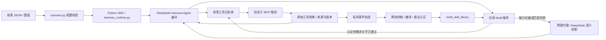

# 场景、Motif 和 Harness 的接口

## 运行链路与边界



Python controller 与 JavaScript online runtime 是两条执行路径：在线插件使用 JS 子集，并未通过 RPC 调用 Python controller。不要把它们描述为完整同构实现。DSH 实际执行 MCP 工具；插件只在认证的只读步骤上替代一次模型决策。

## 已确定的技术路线与当前交付形态

后续采用 **Python 离线学习/编译，TypeScript 在线执行**。新增 Harness 在线逻辑使用 TypeScript；现有 JS 插件逐步迁移，Python controller 保留为参考和离线验证。生产在线 Runtime 以 TypeScript 为权威，不另建 Python 在线决策进程。双方通过版本化、带摘要及证据的 Motif IR/library 对接；类型定义之外仍需运行时校验和协议一致性测试。

当前安装清单固定 `@deepseek-ai/dsh` 为 `0.1.5-rc.3`，安装后由 `harness_runtime.py` 启动 `node_modules/@deepseek-ai/dsh/lib/bin.js`。因此运行时包含真正的本地 Harness，Git 仓库不内置其源码副本。`dsh_online_motif.mjs` 是原生插件，通过生成的 patch 和本地文件 URI 挂载；baseline 不加载该插件，shadow/execute 显式加载。

SSS 当前是“插件实现 + 编译器 + 科研实验环境”，还不是独立分发的 Harness 插件包。产品化需要严格类型、共享 Schema/兼容规则、构建/打包和安装入口。实验入口及预算代理使用 Python；在线 `runPureCode` 还会启动 `pure_code.py`。解除已有 library 执行对 Python 的依赖时，必须保留预算约束和纯代码隔离/校验，不能简单删掉这两项。外部 MCP 和 embedding 服务的部署依赖仍由具体服务决定。

## 1. 自定义 MCP 场景接口

每个场景放在 `scenarios/<name>/`，包含 `scenario.json`、题面、必要的服务/契约和独立测试。复制 example 即可。配置版本是 `schema_version: 1`；服务器顺序、工具名字/顺序和提示尽量保持稳定。

```json
{
  "schema_version": 1,
  "name": "my_scene",
  "prompt": "prompt.md",
  "servers": [{
    "server_name": "papers",
    "transport": "stdio",
    "command": "${PYTHON}",
    "args": ["${PROJECT_ROOT}/scenarios/my_scene/server.py"],
    "cwd": "${PROJECT_ROOT}",
    "env": {"PAPER_API_KEY": {"from_env": "PAPER_API_KEY"}}
  }],
  "allowed_tools": ["mcp__papers__find", "mcp__papers__read"]
}
```

支持 `${PROJECT_ROOT}`、`${PYTHON}`、`${CASE}` 三种公开占位符。题面路径相对配置文件；配置里的进程 cwd 默认是项目根。服务名限小写字母、数字、下划线，工具全名限制 64 字符，以避免 Harness 改写名字造成契约不一致。

HTTP 服务将 server 替换为：

```json
{
  "server_name": "papers",
  "transport": "streamable-http",
  "url": "http://127.0.0.1:8765/mcp",
  "headers": {"Authorization": {"from_env": "PAPER_MCP_AUTH"}},
  "tool_call_timeout_ms": 60000
}
```

`PAPER_MCP_AUTH` 应包含服务需要的完整认证头。`from_env` 只保存变量名，在 Harness 子进程中求值；预览、生成的 patch 和 Git 不包含其值。密钥不能写成 JSON 字面量。HTTP 配置路径已验证；真实 HTTP 服务握手仍需场景负责人联调。

白名单会限制模型可见工具，并在派发时再次拒绝其他工具。新增服务无需改图核心或上游 Harness。新场景默认先做只读验证；有副作用的 MCP 必须在服务端限制作用域、提供写操作预览与明确确认，现有通用入口不会替任意 MCP 实现业务授权。模型可调用的工具也不自动获得 Motif 执行资格。

## 2. MCP → Motif 的数据契约

推荐每个只读对象返回 `object_id`、`source_id`、`version_sha256`。句柄必须由前一步实际返回，绑定版本，旧版本应由服务端拒绝。参数或结果相等本身不是依赖证据。example 服务提供 `pin_note → read_pinned_note` 的最小实例。

`contracts.json` 将 Harness **实际完整工具名**映射到契约，主要字段：

| 字段 | 含义 |
| --- | --- |
| `required_params` / `default_params` / `parameter_shapes` | 参数名、真实默认值与形状；须与 MCP schema 相符 |
| `read_only` | 是否只读；写操作不进入当前结构执行子集 |
| `output_fields` | 可引用输出字段，允许显式点路径 |
| `provenance_params` | 必须来自工具返回的参数，而非模型猜出的值 |
| `replay_stable` / `observed_anchor` | 可认证重放，或仅允许正常 Agent 的新鲜结果作锚点 |
| `description` | MCP 提供的实际描述；有 schema 文件时通过 `tool_schema_contracts.py` 绑定 |

合成科研任务的完整范例在 `config/research-portfolio-tool-contracts.json`。`tests/fixtures/contracts/` 的 Gmail/Zotero 等只保留历史协议样本，用于参数来源回归；对应真实应用连接器已经归档。

## 3. 轨迹 → library → 在线 manifest

首发分发库在 `examples/motif-library/research-portfolio-v1/`：4 个历史 DeepSeek 轨迹编译出的 Motif，保留原认证摘要。`library.json` 是离线产物，插件加载 `online-manifest.json`；`task.json` 仅适用于所记录的 `l_retrieval_persistence` 来源快照。`npm run motif:rebuild` 从公开证据重新挖掘认证并核对相同产物，`npm run motif:check` 加验真实 Harness/MCP 的本机模拟闭环。重编译输出只写 `.local/`，不依赖历史私有轨迹，不改通用编译器的私有数据路径约束。样例重编译使用 witnessed-edge 路径；下面的通用 CLI 使用连续序列 library 路径，两者不能混报。

公开证据是审核后与仓库合成 MCP 逐项重放一致的最小夹具，不是允许提交原始运行日志的例外。历史云请求出处与当前模拟验收分别记录；该样例没有真实研究交付质量或实际费用结论。具体命令、来源、版本锁与范围见样例 README。

普通 Harness 的运行目录位于 `.local/runs/<id>/`：

- `manifest.json`：题目、任务 ID、提示/配置哈希、工具顺序、模型和预算；
- `agent-events.jsonl`：原始工具与模型事件，结果不能被压缩替换后的内容冒充；
- `answer.md`、`metrics.json`、`cost-ledger.jsonl`：交付、用量与逐请求预算记账；
- `.local/online-motif/<session-hash>.jsonl`：开启插件时的决策审计。

人确认不同研究决定的 ID 后，冻结每份轨迹：

```sh
node scripts/project.mjs python scripts/freeze-dsh-task-identity.py --task-dir .local/runs/RUN_ID --decision-id scene-decision-001 --events agent-events.jsonl
```

编译清单放在 `.local/`，内容如下。至少两项独立训练决定和一项独立认证决定；改 trace 名不能制造独立性。

```json
{
  "contracts": {"完整工具名": {"required_params": ["id"], "read_only": true, "output_fields": ["source_id"], "replay_stable": true, "description": "实际 MCP 描述"}},
  "train": [
    {"trace_id": "t1", "events": "runs/RUN1/agent-events.jsonl", "identity": "runs/RUN1/task-identity.json"},
    {"trace_id": "t2", "events": "runs/RUN2/agent-events.jsonl", "identity": "runs/RUN2/task-identity.json"}
  ],
  "heldout": [
    {"trace_id": "h1", "events": "runs/RUN3/agent-events.jsonl", "identity": "runs/RUN3/task-identity.json"}
  ]
}
```

这里的 contracts 只是字段说明，须换成场景的完整工具契约；只写一个工具无法构成示例读取链。可加 `tool_schema_file` 与显式 `provenance` sidecar；路径相对清单。编译器只接受 `.local` 下的原始轨迹和身份锁，并拒绝同决定/同问题的伪独立样本。

```sh
node scripts/project.mjs python scripts/compile-dsh-motif-library.py --manifest .local/traces.json --out .local/motifs/library.json
node scripts/project.mjs python scripts/export-online-motif-manifest.py --library .local/motifs/library.json --contracts scenarios/my_scene/contracts.json --version-fields .local/version-fields.json --output .local/motifs/online.json
```

`version-fields.json` 是参与该 library 的工具名到真实版本字段的映射；不能加入未编译工具或编造字段。可加 `--slot-rules` 限制初始标识符。library 含轨迹来源、参数流、DAG/局部代码、认证摘要；不是手写工作流或 Codex Skill。训练后必须留另一组独立任务做效果评测。

## 4. 在线 Motif 插件接口

准备结构任务 `.local/current-task.json`，由任务负责人填写：

```json
{
  "schema_version": 1,
  "task_id": "scene-next-decision",
  "session_id": "unique-unused-session",
  "intent": "此次研究决定的具体目标",
  "input_version": "此次输入的冻结版本",
  "bindings": {"完整入口工具名": {"真实参数名": "已授权标识符"}},
  "source_versions": {"完整工具名": "已验证来源版本"}
}
```

Bindings 必须是 manifest 认可的参数槽；版本可以使用运行时认可的 `@observed` / `@from_anchor`，其守卫仍依赖实际新鲜工具结果，不表示取消版本核验。参见 `parseStructuredTask` 及其测试。不要复制旧答案填成新任务。

```sh
npm run scenario -- --scenario scenarios/my_scene/scenario.json --mode shadow --manifest .local/motifs/online.json --task .local/current-task.json --embedding-endpoint http://127.0.0.1:8123/v1/embeddings --embedding-model LOCAL_MODEL
```

默认只校验并预览。加 `--call-model --budget-usd 0.25` 才开始付费任务。`shadow` 记录候选但继续调用模型；`execute` 尝试替代模型请求。插件使用环境变量 `SSS_ONLINE_MOTIF_*` 和 `SSS_MOTIF_EMBEDDING_*`，由入口统一设置。

插件依赖 DSH 的 `agent/created`、`tools/result`、`llm/stream` 和 agent-loop 标记。在匹配会话与冻结提示内，校验 library 摘要、实际可用工具 schema、参数来源、版本及依赖。命中时返回标准工具调用流，由 Harness 派发；工具结果复核通过后才记录 `model_request_skipped_verified`。无命中、歧义、权限/版本变化和工具失败会返回模型判断或停止结构继续，不能仅凭发起 bypass 计为成功节省。

当前插件要求本机 embedding 配置。唯一闭合的部分读取链可直接使用结构证据；其他匹配可能调用本机 embedding 服务。其服务/模型是可选依赖，基础安装不下载权重。`scripts/local_embedding_server.py` 和下载脚本保留为可选参考；需另装 torch、transformers、huggingface_hub，使用固定权重和版本自行验证。

Python 语义端口在 `motif_read_semantic.py`：接收明确的结构缺口，调用受预算代理保护的 `dsh_client.call_bounded_prompt`，校验输出，交回 `SemanticResolution` 恢复。`harness_runtime.py` 将 SDK 私有 `_launch_args` 接缝限制在一个文件；升级固定的 DSH/SDK 版本时必须重新验证。

`motif_output_projection.py` 与编译器的 evidence projection 只保留为可选机制及回归测试，不挂在新入口默认链路。旧 Distil/压缩启动器已归档。

## 5. 科研 PPT 场景（V5 / V6）

入口是 `python -m scenarios.research_ppt.cli prepare/run/learn/improve`，配置与安装要求见 [场景 README](../scenarios/research_ppt/README.md)。当前接收 1–8 份 PDF/PPTX 和 1–30 页要求；生成可编辑文字、表格与原生 bar/line 图表，使用 `academic` / `lab` 两套内置风格。任意用户母版、OCR、动画保真未实现。

普通生成会话默认将版本化 `skills/research-design/SKILL.md` 加入稳定提示前缀并记录 SHA；`prepare --no-design-skill` 可关闭。Skill 是设计指导，不是 Motif。`render_deck(plan)` 页面新增可选 `takeaway`（1–90 字符）和 `layout="process"`、`process:{steps:[{label,detail},...]}`；2–5 步，label≤28、detail≤90 字符，`bullets=[]`，不与其他主体结构混用。流程框、文字和箭头原生可编辑；合法 schema 仍可能超容量，须据枚举诊断修正。manifest 记录 `layout_policy/layout_policy_sha256/semantic_content_sha256` 和几何检查，不冒称事实或像素视觉认证。

审查后契约修复只将缺失的页面 `bullets` 补为 `[]`，在深复制计划上执行并记录 `plan_normalized` 页号；显式 `null` 或错误类型仍拒绝，不删除正文、来源或 notes。修复后的对照使用独立配置与 cohort，不追改原运行记录。

`list_inputs → pin_source → read_source/read_page` 提供带来源版本的内容；素材只能引用实际返回的句柄。`render_deck(plan)` 或 `restyle_deck(source_id, template)` 在授权任务的私有副本目录写产物；`inspect_deck → validate_deck → deliver_deck` 检查实际 PPTX、LibreOffice PDF、逐页 PNG 和产物/输入 SHA256。缓存验证和交付前还重核全部 PDF/PNG 的私有路径、存在性及 SHA；缺失、替换或越界会使旧核验失效，需生成新副本并重建预览。旧验证、输入变更及产物篡改不能交付。图像为位图，不能称图内文字可编辑。

PDF 的 `read_page` 返回 `figure_candidates`（真实图注、页面归一化 bbox、`candidate_id`），`extract_figure(source_id, page, candidate_id=...)` 使用实际几何候选。旧 `bbox` 参数保持兼容，但局部裁图须有对应图注和图形依据；整页证据须标识为整页。无法定位时明确 abstain。图注/几何只能约束位置，不保证图意、选材或所有 PDF 图件识别正确。

`build_delivery(plan)` 组合相同的生成、检查、验收和交付函数，是普通脚本对照。`validate_deck.passed` 只表示包结构、真实渲染与文字完整性检查通过；事实、图意和视觉质量仍需审阅。不会自动覆盖原文件或把程序通过当作人工质量认证。

对已指定 `operation=restyle` 的任务，组合计划为 `{"operation":"restyle","source_id":"实际句柄","template":"academic或lab"}`，调用相同的重风格函数。当前受限转换识别标题、转换已知模板装饰并维持表头文字对比；未知形状与用户背景保留。文本、表格单元格、几何、原 notes、媒体、图表及嵌入数据均检查保留；布局或 notes 保留失败会返回业务错误，不交付。不是任意母版重建或复杂排版优化，仍须查看真实预览。

本场景默认 `contracts.json` 只描述 `pin_source.source_id → read_source.source_id` 的只读参数边；V6 动态目录契约须按实际 schema 另行导出并认证。生成/核验链不在在线只读 Motif 执行范围。RSI 的 `rsi_status/propose_guard` 只在显式 `--allow-rsi` 任务开放，可提出固定 schema 的 `formats/min_text_chars/max_pages` 准入程序，经过固定协议验证原子启用；该接口不能生成任意工具或扩大权限。领域效果与失败恢复须以独立真实任务另行验证。

服务端对每个任务持久限制最多 3 次准入提案，schema 失败也计数，重启不重置；超限拒绝并保留旧 active。`rsi_status.attempts_remaining` 返回余量。真实首次 RSI 的 6 次提案发生在硬限制补丁前，历史记录保留，不能追改为符合新限制。

V5 另提供受限布局学习：`prepare --layout-suite PRIVATE_SUITE --allow-rsi --allow-output` 固定真实历史计划与 train/heldout；`python -m scenarios.research_ppt.layout_learning --job JOB --prepare-training` 真实回放训练基线。对应 `cli improve` 只开放 `layout_policy_status/propose_layout_policy`，前者只读训练诊断、不泄露留出；后者提交完整七字段策略，最多三次持久提案，失败也计数。字段固定为 `schema_version=1`、`media_position=right/bottom`、`media_fraction=0.50–0.72`、`body_columns=1/2`、整数 `body_font_size=20–24/table_font_size=17–20`、`body_gap=0.08–0.28`。禁止代码、内容、权限与验证器变更；格式合法不自动晋级。

`layout_learning --job JOB --proposal PROPOSAL --certify` 将独立认证集绑定一个冻结候选，真实生成/渲染并复核内容、原生文字、notes/来源与证据版本。`prepare --layout-policy CERTIFICATE` 只加载完整机械认证证书；准备、运行和渲染入口重核提案、资料、代码及产物 SHA。策略布局失败仅对 `text_overflow/table_overflow/chart_label_overflow/out_of_bounds/content_overlap` 回退默认策略，新目录保留失败；证书或权限/版本错误不能借此回退。MCP 公开固定错误与合法 `page/role`，未知消息和路径屏蔽。机械认证不是审美或科学质量认证。

`python -m scenarios.research_ppt.experiment_v5` 默认只预览；`--call-model` 才真实运行，`--certificate` 固定策略证据，缺证书时策略组明确跳过。V5 已完成服务器回归、真实布局提案/独立机械认证及五题三组 API 对照；工具交付不代表科研内容合格或同质量降本。审查反馈修订 pilot 单列；实际数据、反例与权限见 [实验记录](experiments/research-ppt-v5-design-rsi-20261010.md)，与 V2 历史结果分别保留。

V6 新增 `read_deck_plan(deck_id)` / `revise_deck(deck_id, updates:[{page,changes}])`。仅支持同一 MCP 服务会话生成并保留原计划的 PPT，服务重启后的状态恢复尚未实现；新副本保留未指定字段，实际核验非目标页 OOXML/notes/媒体/表格/图表/几何及共享样式，否则不登记候选为可交付。原稿保留，新稿必须重新核验。`validate_deck` 实际写 PDF/PNG，MCP 标注为非只读，不纳入只读 Motif。

V6 `tool_learning` 是 Python 离线控制器，真实模型根据正常轨迹输出纯 JSON TypeScript 候选；受限 AST、真实 tsc/Node、至少两个真实训练来源、模型结果后 accept 决定和一次隐藏独立功能认证后才可加载。`prepare --generated-tool-certificate` 绑定证书 SHA，场景动态开放 `pin_figure_catalog(document_id)` 和模型命名 `read_pinned_…(source_id)`。该目录作用域句柄与普通来源句柄不同；返回 `source_id/version_sha256/figures/tool_code_sha256/evidence_scope`，只包含实际图注/页码/候选/bbox。TypeScript 模块实际执行，固定 oracle 另核结果；模型仍负责选图与科研解释。改变证书、宿主、编译器、代码、schema、来源或证据须重新认证，不能自动晋级诊断候选。

`motif_v6 --mining witnessed_edges` 复用公共完整轨迹参数边挖掘与独立认证，动态工具契约和实际 MCP schema 在私有实验中冻结；不手写 DAG、裁剪事件或修改公共在线规则。已认证结构仍需在线守卫和实际旁路审计，结构认证不自动注册产品或通过质量/总成本门槛。默认相邻挖掘仍保留，首次未发现目录参数边的负例单列。范围、真实对照及局限见 [V6 实验记录](experiments/research-ppt-v6-tool-rsi-20261011.md)；既有生成/修订/核验写链仍不能由只读 Motif 执行。
