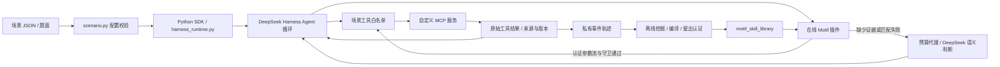

# 场景、Motif 和 Harness 的接口

## 官方 Web 新入口（0.1.5-rc.3）

`npm run web` → `scripts/harness-web.py` → 官方 `dsh --profile web --patch <私有 host overlay>`。执行、会话、队列、模型消息和工具调度仍归官方 Harness 所有；SDK 的 `run-scenario.py` 与 `harness_runtime.py` 继续保留。配置入口为 `config/harness-web.json`，适配策略为 TypeScript `src/adapters/dsh_web_policy.ts`。

已核对安装包中 `dsh-web-app`、`dsh-client-connection`、`dsh-api-session-controller`、`dsh-agent-presets` 的 README、声明和实际实现。Web 以宿主层和会话 preset 组合，不能直接装 SDK patch 的模型工具层。`prepare_scenario()` 新增 `mcp_rows` 和 `environment_references` 描述供 Web 生成专用 preset，原 SDK patch 仍保持原语义。

- 宿主：官方认证、Web、connection、Gateway、Controller；独立 `DSH_HOME`。仅配置一个系统信任根和 `sss-task` preset，关闭 shipped/user 根，用户不能复制或删除系统 preset。
- preset：persona 与已有场景 MCP；示例两个带版本守卫的只读工具。portfolio 使用固定 `l_retrieval_persistence` 合成夹具和首发历史 library。
- 策略：包装当前 Controller 实例的公开 `create/prompt/selectModel/fork/cancel` 方法，原参数及 prompt 的取消信号传给原方法。串行创建，首次创建绑定唯一 session；后续只允许采用相同 ID，整个启动周期最多接收一个固定题面。恢复、模型请求及实际工具调用仍受宿主 guard 限制。
- 模型：取消可配置的 DeepSeek/pi-ai 注册，使用官方 `DeepSeekAdapter` 注册固定 loopback 预算连接，不注册可编辑 provider 配置。全局 `llm/stream` 拒绝其他 session、provider/model、非 Off、输出上限变化和辅助请求；关闭标题模型、retry 插件和压缩入口。计价与预算结算复用 `deepseek_cost_gate.State/create_server`；新增可选请求数上限不改变 SDK 默认行为。
- Motif：首次接收题面时把真实 Web session 写入私有结构任务，以已冻结题面摘要、工具 schema、manifest 和来源版本为守卫。复用 `createOnlineInterceptor`、`loopbackSimilarity`；execute 返回标准工具 stream，官方执行后 `tools/result` 才验证批次。shadow 只记候选；任务变更、schema 漂移拒绝，旧来源版本与执行失败回退模型。失败批次与 verified skip 集合必须不相交。

官方认证只通过根路径的 token 交换 HttpOnly/SameSite cookie；原生 RPC 不接受 URL/header token。已验证的 unary 路径来自安装接口：`POST /api/session/create`、`prompt`、`selectModel`、`fork`、`cancel`。请求为 `{type:"client-request",rpcId,method:"session/<method>",payload:{args:{request:<原生请求>}}}`；队列和会话流继续走原生 `/api/remote.mux`，SSS 没有自建状态机或替换事件。RPC 的错误仍使用官方 envelope。公共脚本 `web:check` 仅用于原生协议诊断；浏览器验收独立记录。

输入框会裁剪两端空白，所以同时保存原始题面摘要和 `strip/trim` 后的传输摘要，不改内部字符。工具 schema 必须带 `scopeOf(agent.ctx)` 读取 preset 视图，并按官方 `dsh-system-prompt` 的默认代码点排序比较完整 schema；不能用空的全局工具表替代它，也不能取消 schema 检查。

每次输出独占 `.local/web/runs/<RUN_ID>/`：`effective-config.json`（commit、dirty 文件、环境/来源摘要、实际配置）、`policy.json`、`host.patch.yml`、`presets/`、`prompt.md`、`tool-schemas.json`、`task-state.json`、`events.jsonl`、`answer.json`、`metrics.json`、`ledger.jsonl`、`motif-audit.jsonl`。Motif 模式另有 `task.json/bound-task.json`。`mock-requests.json` 在停止时保存；模拟用量不等于账单。状态有 ready/running/completed/failed/cancelled/budget_exhausted，失败原因保留。

安全边界是首版单操作人联调：一个服务器进程接收一个任务，不能提供完整多人账号隔离；认证浏览器的官方文件能力也不是文件沙箱。真实模型与付费确认流程尚未开放，论文、真实应用质量及降本未验证。升级必须复核服务方法、Gateway 参数描述、事件和 preset 接缝；上游包只读。详见 [Web 交接](handoffs/harness-web.md)。

## 运行链路与边界



Python controller 与 JavaScript online runtime 是两条执行路径：在线插件使用 JS 子集，并未通过 RPC 调用 Python controller。不要把它们描述为完整同构实现。DSH 实际执行 MCP 工具；插件只在认证的只读步骤上替代一次模型决策。

## 已确定的技术路线与当前交付形态

后续采用 **Python 离线学习/编译，TypeScript 在线执行**。新增 Harness 在线逻辑使用 TypeScript；现有 JS 插件逐步迁移，Python controller 保留为参考和离线验证。生产在线 Runtime 以 TypeScript 为权威，不另建 Python 在线决策进程。双方通过版本化、带摘要及证据的 Motif IR/library 对接；类型定义之外仍需运行时校验和协议一致性测试。

当前安装清单固定 `@deepseek-ai/dsh` 为 `0.1.5-rc.3`，安装后由 `harness_runtime.py` 启动 `node_modules/@deepseek-ai/dsh/lib/bin.js`。因此运行时包含真正的本地 Harness，Git 仓库不内置其源码副本。`dsh_online_motif.mjs` 是原生插件，通过生成的 patch 和本地文件 URI 挂载；baseline 不加载该插件，shadow/execute 显式加载。

SSS 当前是“插件实现 + 编译器 + 科研实验环境”，还不是独立分发的 Harness 插件包。产品化需要严格类型、共享 Schema/兼容规则、构建/打包和安装入口。实验入口及预算代理使用 Python；在线 `runPureCode` 还会启动 `pure_code.py`。解除已有 library 执行对 Python 的依赖时，必须保留预算约束和纯代码隔离/校验，不能简单删掉这两项。外部 MCP 和 embedding 服务的部署依赖仍由具体服务决定。

## 1. 自定义 MCP 场景接口

每个场景放在 `scenarios/<name>/`，包含 `scenario.json`、题面、必要的服务/契约和独立测试。复制 example 即可。配置版本是 `schema_version: 1`；服务器顺序、工具名字/顺序和提示尽量保持稳定。

```json
{
  "schema_version": 1,
  "name": "my_scene",
  "prompt": "prompt.md",
  "servers": [{
    "server_name": "papers",
    "transport": "stdio",
    "command": "${PYTHON}",
    "args": ["${PROJECT_ROOT}/scenarios/my_scene/server.py"],
    "cwd": "${PROJECT_ROOT}",
    "env": {"PAPER_API_KEY": {"from_env": "PAPER_API_KEY"}}
  }],
  "allowed_tools": ["mcp__papers__find", "mcp__papers__read"]
}
```

支持 `${PROJECT_ROOT}`、`${PYTHON}`、`${CASE}` 三种公开占位符。题面路径相对配置文件；配置里的进程 cwd 默认是项目根。服务名限小写字母、数字、下划线，工具全名限制 64 字符，以避免 Harness 改写名字造成契约不一致。

HTTP 服务将 server 替换为：

```json
{
  "server_name": "papers",
  "transport": "streamable-http",
  "url": "http://127.0.0.1:8765/mcp",
  "headers": {"Authorization": {"from_env": "PAPER_MCP_AUTH"}},
  "tool_call_timeout_ms": 60000
}
```

`PAPER_MCP_AUTH` 应包含服务需要的完整认证头。`from_env` 只保存变量名，在 Harness 子进程中求值；预览、生成的 patch 和 Git 不包含其值。密钥不能写成 JSON 字面量。HTTP 配置路径已验证；真实 HTTP 服务握手仍需场景负责人联调。

白名单会限制模型可见工具，并在派发时再次拒绝其他工具。新增服务无需改图核心或上游 Harness。新场景默认先做只读验证；有副作用的 MCP 必须在服务端限制作用域、提供写操作预览与明确确认，现有通用入口不会替任意 MCP 实现业务授权。模型可调用的工具也不自动获得 Motif 执行资格。

## 2. MCP → Motif 的数据契约

推荐每个只读对象返回 `object_id`、`source_id`、`version_sha256`。句柄必须由前一步实际返回，绑定版本，旧版本应由服务端拒绝。参数或结果相等本身不是依赖证据。example 服务提供 `pin_note → read_pinned_note` 的最小实例。

`contracts.json` 将 Harness **实际完整工具名**映射到契约，主要字段：

| 字段 | 含义 |
| --- | --- |
| `required_params` / `default_params` / `parameter_shapes` | 参数名、真实默认值与形状；须与 MCP schema 相符 |
| `read_only` | 是否只读；写操作不进入当前结构执行子集 |
| `output_fields` | 可引用输出字段，允许显式点路径 |
| `provenance_params` | 必须来自工具返回的参数，而非模型猜出的值 |
| `replay_stable` / `observed_anchor` | 可认证重放，或仅允许正常 Agent 的新鲜结果作锚点 |
| `description` | MCP 提供的实际描述；有 schema 文件时通过 `tool_schema_contracts.py` 绑定 |

合成科研任务的完整范例在 `config/research-portfolio-tool-contracts.json`。`tests/fixtures/contracts/` 的 Gmail/Zotero 等只保留历史协议样本，用于参数来源回归；对应真实应用连接器已经归档。

## 3. 轨迹 → library → 在线 manifest

首发分发库在 `examples/motif-library/research-portfolio-v1/`：4 个历史 DeepSeek 轨迹编译出的 Motif，保留原认证摘要。`library.json` 是离线产物，插件加载 `online-manifest.json`；`task.json` 仅适用于所记录的 `l_retrieval_persistence` 来源快照。`npm run motif:rebuild` 从公开证据重新挖掘认证并核对相同产物，`npm run motif:check` 加验真实 Harness/MCP 的本机模拟闭环。重编译输出只写 `.local/`，不依赖历史私有轨迹，不改通用编译器的私有数据路径约束。样例重编译使用 witnessed-edge 路径；下面的通用 CLI 使用连续序列 library 路径，两者不能混报。

公开证据是审核后与仓库合成 MCP 逐项重放一致的最小夹具，不是允许提交原始运行日志的例外。历史云请求出处与当前模拟验收分别记录；该样例没有真实研究交付质量或实际费用结论。具体命令、来源、版本锁与范围见样例 README。

普通 Harness 的运行目录位于 `.local/runs/<id>/`：

- `manifest.json`：题目、任务 ID、提示/配置哈希、工具顺序、模型和预算；
- `agent-events.jsonl`：原始工具与模型事件，结果不能被压缩替换后的内容冒充；
- `answer.md`、`metrics.json`、`cost-ledger.jsonl`：交付、用量与逐请求预算记账；
- `.local/online-motif/<session-hash>.jsonl`：开启插件时的决策审计。

人确认不同研究决定的 ID 后，冻结每份轨迹：

```sh
node scripts/project.mjs python scripts/freeze-dsh-task-identity.py --task-dir .local/runs/RUN_ID --decision-id scene-decision-001 --events agent-events.jsonl
```

编译清单放在 `.local/`，内容如下。至少两项独立训练决定和一项独立认证决定；改 trace 名不能制造独立性。

```json
{
  "contracts": {"完整工具名": {"required_params": ["id"], "read_only": true, "output_fields": ["source_id"], "replay_stable": true, "description": "实际 MCP 描述"}},
  "train": [
    {"trace_id": "t1", "events": "runs/RUN1/agent-events.jsonl", "identity": "runs/RUN1/task-identity.json"},
    {"trace_id": "t2", "events": "runs/RUN2/agent-events.jsonl", "identity": "runs/RUN2/task-identity.json"}
  ],
  "heldout": [
    {"trace_id": "h1", "events": "runs/RUN3/agent-events.jsonl", "identity": "runs/RUN3/task-identity.json"}
  ]
}
```

这里的 contracts 只是字段说明，须换成场景的完整工具契约；只写一个工具无法构成示例读取链。可加 `tool_schema_file` 与显式 `provenance` sidecar；路径相对清单。编译器只接受 `.local` 下的原始轨迹和身份锁，并拒绝同决定/同问题的伪独立样本。

```sh
node scripts/project.mjs python scripts/compile-dsh-motif-library.py --manifest .local/traces.json --out .local/motifs/library.json
node scripts/project.mjs python scripts/export-online-motif-manifest.py --library .local/motifs/library.json --contracts scenarios/my_scene/contracts.json --version-fields .local/version-fields.json --output .local/motifs/online.json
```

`version-fields.json` 是参与该 library 的工具名到真实版本字段的映射；不能加入未编译工具或编造字段。可加 `--slot-rules` 限制初始标识符。library 含轨迹来源、参数流、DAG/局部代码、认证摘要；不是手写工作流或 Codex Skill。训练后必须留另一组独立任务做效果评测。

## 4. 在线 Motif 插件接口

准备结构任务 `.local/current-task.json`，由任务负责人填写：

```json
{
  "schema_version": 1,
  "task_id": "scene-next-decision",
  "session_id": "unique-unused-session",
  "intent": "此次研究决定的具体目标",
  "input_version": "此次输入的冻结版本",
  "bindings": {"完整入口工具名": {"真实参数名": "已授权标识符"}},
  "source_versions": {"完整工具名": "已验证来源版本"}
}
```

Bindings 必须是 manifest 认可的参数槽；版本可以使用运行时认可的 `@observed` / `@from_anchor`，其守卫仍依赖实际新鲜工具结果，不表示取消版本核验。参见 `parseStructuredTask` 及其测试。不要复制旧答案填成新任务。

```sh
npm run scenario -- --scenario scenarios/my_scene/scenario.json --mode shadow --manifest .local/motifs/online.json --task .local/current-task.json --embedding-endpoint http://127.0.0.1:8123/v1/embeddings --embedding-model LOCAL_MODEL
```

默认只校验并预览。加 `--call-model --budget-usd 0.25` 才开始付费任务。`shadow` 记录候选但继续调用模型；`execute` 尝试替代模型请求。插件使用环境变量 `SSS_ONLINE_MOTIF_*` 和 `SSS_MOTIF_EMBEDDING_*`，由入口统一设置。

插件依赖 DSH 的 `agent/created`、`tools/result`、`llm/stream` 和 agent-loop 标记。在匹配会话与冻结提示内，校验 library 摘要、实际可用工具 schema、参数来源、版本及依赖。命中时返回标准工具调用流，由 Harness 派发；工具结果复核通过后才记录 `model_request_skipped_verified`。无命中、歧义、权限/版本变化和工具失败会返回模型判断或停止结构继续，不能仅凭发起 bypass 计为成功节省。

当前插件要求本机 embedding 配置。唯一闭合的部分读取链可直接使用结构证据；其他匹配可能调用本机 embedding 服务。其服务/模型是可选依赖，基础安装不下载权重。`scripts/local_embedding_server.py` 和下载脚本保留为可选参考；需另装 torch、transformers、huggingface_hub，使用固定权重和版本自行验证。

Python 语义端口在 `motif_read_semantic.py`：接收明确的结构缺口，调用受预算代理保护的 `dsh_client.call_bounded_prompt`，校验输出，交回 `SemanticResolution` 恢复。`harness_runtime.py` 将 SDK 私有 `_launch_args` 接缝限制在一个文件；升级固定的 DSH/SDK 版本时必须重新验证。

`motif_output_projection.py` 与编译器的 evidence projection 只保留为可选机制及回归测试，不挂在新入口默认链路。旧 Distil/压缩启动器已归档。
