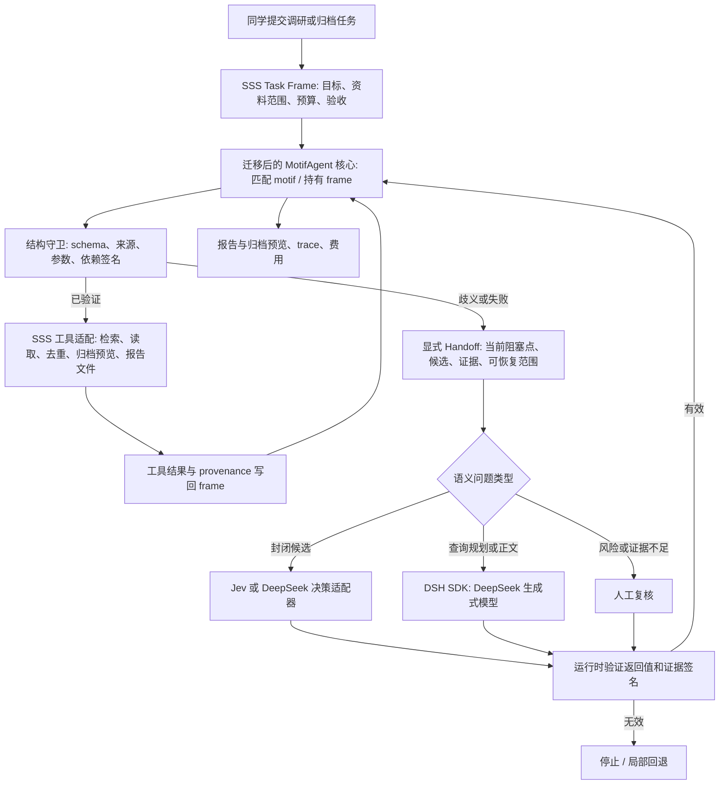

# MotifAgent on SSS 与 DeepSeek Harness：职责和执行链

> **最新修订（2026-09-25）：** SSS 结构核心独立持有流程和验证，DeepSeek Harness 是第一个可替换的语义执行器。当前实现与剩余迁移见 [SSS 核心与 Harness 集成边界](SSS核心与Harness集成.md)。下文保留历史阶段设计供追溯。

> 2026-09-25。目标架构；下文单列当前已实现部分。MotifAgent 本地 artifact 是内核来源，冻结仓库保持只读。SSS 将在保留许可与来源记录的前提下复制必要模块、删减基准专用代码并适配科研／办公工具。DeepSeek Harness（DSH）是模型与工具接入层，也是原生 Agent 基线，不与 MotifAgent 同时控制同一条任务循环。

## 一句话关系

**MotifAgent 决定任务怎么走；SSS 的领域适配器提供论文、目录、报告等操作；DSH 执行需要生成模型的有界语义调用并提供凭证／用量记录。** Jev 将来接在同一个语义决策边界，负责适合 Choice／Score／Noul 的局部判断。

## 目标链条

1. **入口与建帧**：SSS 接收任务及文件，计算来源哈希、工具版本和预算，创建任务状态。公开 benchmark 与用户资料使用相同接口，但资料快照、权限和评价器分开。
2. **结构执行**：迁移后的 MotifAgent 选择并执行已验证 motif。节点读取 SSS 工具结果，参数有来源绑定。可确定的读取、去重、文件命名候选和状态更新不调用模型。
3. **交给语义层**：遇到多个候选、缺少字段、证据冲突或需要写正文时，MotifAgent 产生带 `motif_instance_id`、输入摘要、候选 ID、证据 ID、允许操作、回退方式和预算的 handoff。开放式正文交给 DSH 中的生成模型；Jev 只处理预先定义的有界判断，且可以拒答或转人工。
4. **验证与恢复**：SSS 检查回答格式、候选是否仍在、输入签名有无变化、引文能否定位和写操作是否确认。有效答案写入 frame 后由 MotifAgent 从暂停点恢复；无效时停下或局部回退，不让 DSH 原生 Agent 自己接管后续工具链。
5. **交付与增量更新**：保存报告、证据表、归档预览、完整事件和费用。新增或修改资料时，MotifAgent 根据依赖签名使相关状态失效，再执行受影响子图。是否真正减少重复读取和修订量由 benchmark 测量。

## DSH 的两种使用方式

| 方式 | 谁控制循环 | 用途 |
| --- | --- | --- |
| **SSS 正式路径**：MotifAgent 内核调用 DSH SDK 的受限 profile | MotifAgent | 生成式语义请求、模型配置与用量；模型无权绕过结构守卫直接操作文件 |
| **DSH 原生 Agent**：完整工具和自带循环 | DSH | 同题基线或独立使用，不能与 SSS 正式路径的任务状态混记 |

目前 `src/adapters/harness_semantic.py` 已按第一种方式通过 Python SDK 调用本机 `dsh`，`config/semantic-sdk.patch.yml` 关闭模型可见工具，避免其另起自由工具链；`scripts/run-native-baseline.py` 实现第二种基线。`src/motif_core/` 已从冻结源码迁入 `MotifFrame`、`MotifContextManager`、`BoundEvidence`、确定性依赖求解和 handoff 类型，`scripts/run-motif-office.py` 用这些组件运行合成科研归档任务的 A→B 恢复与失效；相同版本的相互矛盾正式资料会停在显式 handoff。公开 DR³-Eval 的逐项流程以 `src/workflows/motif_research_sources.py` 读取／去重并保存哈希绑定证据，规划前写出 `planning-handoff.json`；`src/workflows/motif_point_selection.py` 把选页决定及候选／必答项签名保存到 MotifFrame，未变时可恢复、变化时失效。检索、选页原文复核和综合仍由 `src/graph/runtime.py` 驱动，DSH 调用仍由原流程直接发起。**这仍是混合迁移，未迁入 TauBench 通用 `MotifExecutor`，也尚未实现单一 Motif 内核主控的完整链条。** `src/adapters/laya_decision.py` 已接本机 Laya，但目前只在公开资料 shadow 扫描中使用，不控制正式任务。DSH Web UI 已能启动，但当前不是 MotifAgent 工作台。旧文档的“DSH 插件先主控”建议由本文件修订：插件可做入口／展示适配，真正的任务循环由 MotifAgent 拥有，避免双重主控。

## 最小迁移边界

已从冻结源码复制并适配 `MotifFrame`／依赖签名／证据绑定／确定性依赖求解；来源、冻结 commit、Apache-2.0 许可和修改清单见 `src/motif_core/PROVENANCE.md`。当前适配器不依赖 TauBench、APIBank 或 SGLang。下一步迁移显式 handoff、接入 DSH 语义端口与受限正文生成，再在 DR³-Eval 和真实组内任务上测完整交付；代码迁移随后共用内核。完整链跑通前，不能宣称已具备论文中的全部 MotifAgent 能力。

## 接口边界和检查点

- `ToolPort`：`read/search/extract/preview_archive/write_draft`，每个结果返回来源、版本、内容哈希和效果类型。真实移动文件须单独确认；benchmark 默认只写副本。
- `SemanticPort`：接受局部 handoff，返回生成文本或封闭候选；DSH／Jev／人工是不同实现。Jev 的概率只是判断信号，不替代来源证明。
- `RunStore`：持久保存 frame、节点结果、模型请求和用量；重启后先验证输入签名再恢复。
- 最低验证：同一公开任务在 SSS 与 DSH 原生 Agent 上同题运行；合成增量任务能证明改动来源使旧结论失效；日志能显示 MotifAgent 的实际执行和 DSH 的实际调用，而不是只显示提示词标签。
